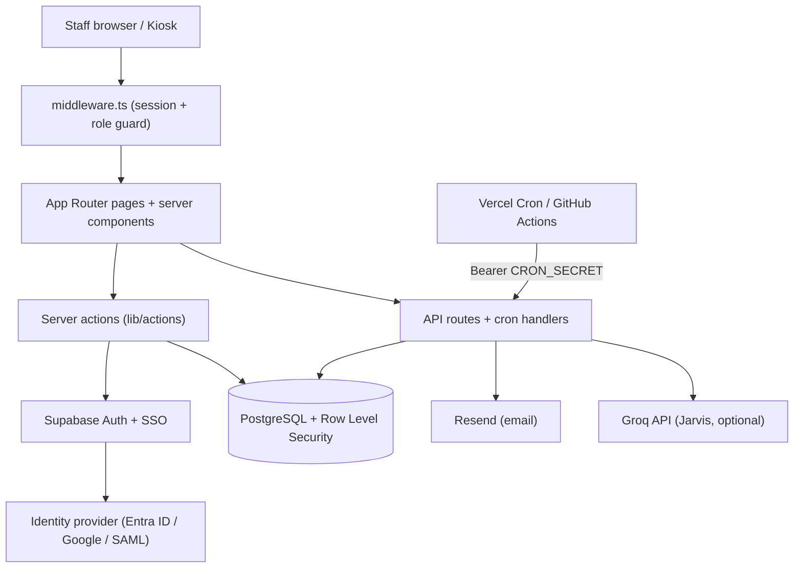

# Architecture

StaffPortal is a single Next.js 16 App Router application on React 19, backed by Supabase. There is no separate backend service: data access runs through React Server Components and server actions that talk to Supabase directly, with a small set of route handlers for the AI assistant, scheduled jobs, and the GDPR export.

## Layout

- `app/(app)/` authenticated routes, with `admin/` for admin and accounts pages
- `app/(auth)/` login, signup, password reset, email verification
- `app/kiosk/` public PIN-based kiosk
- `app/api/chat/` Jarvis assistant; `app/api/cron/` scheduled jobs; `app/api/gdpr/export/` data export
- `app/auth/callback/` OAuth, SAML, and email-link callback
- `lib/supabase/` server, browser, and service-role clients
- `lib/actions/` server actions (the only place that mutates data)
- `lib/audit.ts`, `lib/sso.ts`, `lib/leave-accrual.ts`, `lib/gdpr.ts` core logic
- `supabase/migrations/` ordered SQL, currently through `025`
- `tests/` Node test-runner suites with fixtures

## Auth and authorisation

- Supabase Auth with email and password plus single sign-on
- Session via `@supabase/ssr` cookies, refreshed in `middleware.ts`
- Five roles enforced by Row Level Security on every table
- SSO layered on Supabase: OAuth via `signInWithOAuth`, SAML via `signInWithSSO`, both returning through `/auth/callback`

## Key flows

- **Leave accrual.** `/api/cron/leave-accrual` runs monthly. `computeAccrual` grants elapsed months times the per-balance rate, capped at the entitlement, and is idempotent within a month.
- **GDPR export.** `/api/gdpr/export` gathers every personal-data table for the subject, streams a portable JSON document, and audits the export.
- **Expense claim.** Server action stores the receipt and row, Resend notifies the approver, and a PDFKit claim form is generated on demand.

The deep reference, including the full cron schedule and per-feature detail, lives in the [project wiki](https://github.com/sarmakska/staff-portal/wiki).
